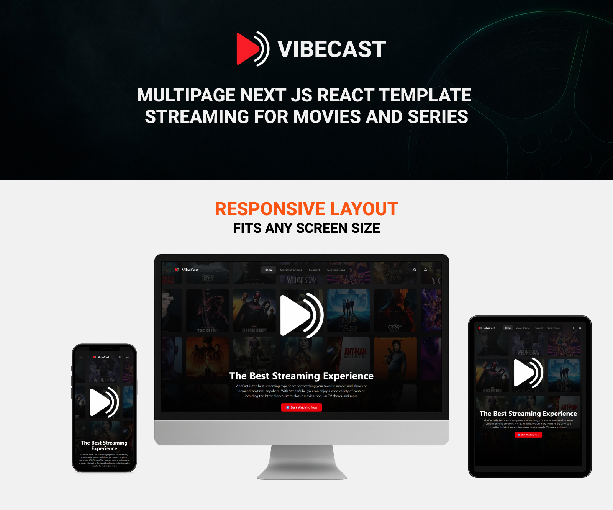
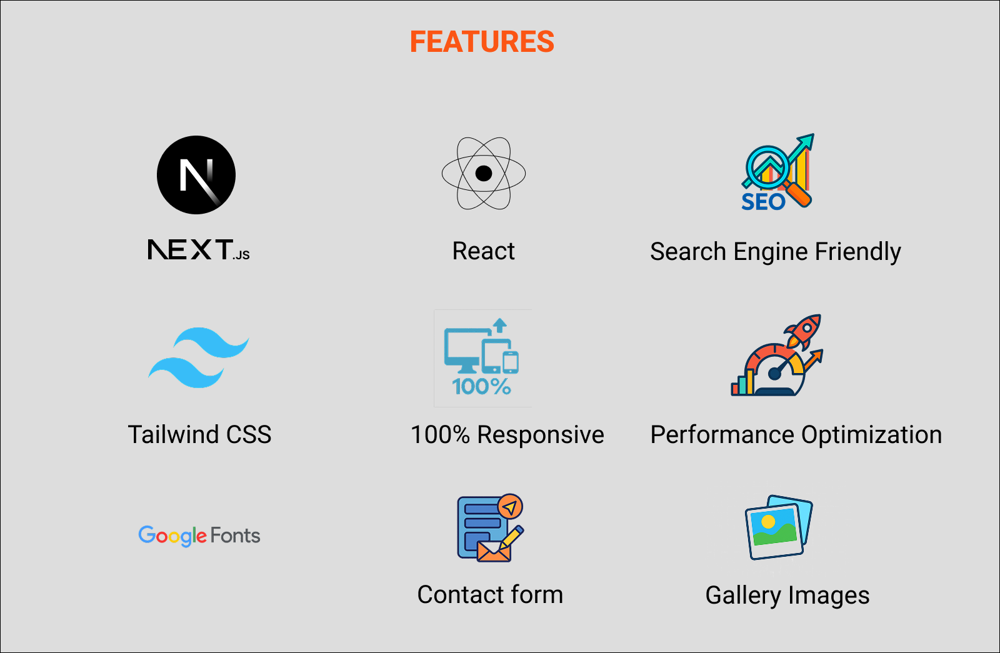

# 🎬 VibeCast – Free Next.js Streaming Template

A beautiful and modern **streaming UI template** built with **Next.js 15**, **Tailwind CSS**, and **ShadCN UI**.

Perfect as a starting point for building:
- 🎥 Video platforms
- 📺 Content portals
- 📈 SaaS MVPs or demos

> 💡 This is the **free version**. Want the full version with more 6+ extra pages: Subscription, Support, 2 Category Page , Product Detail. 
> 👉 [Get the Premium Version on Gumroad →](https://digo1.gumroad.com/l/vibecast-next-js-streaming-template)

---

## 🚀 Live Demo (Free Version)

🔗 [https://vibecast-free.vercel.app](https://vibecast-free.vercel.app)  
*(substitua com seu link real do Vercel assim que publicar)*

---

## ✨ Features (Free Version)

- Modern responsive homepage
- Swiper.js carousels
- Tailwind + ShadCN layout
- SEO-friendly & fast
- Fully mobile-ready

---

## 🔥 Premium Version Includes

✅ 4+ extra pages: Subscription, Support, 2 Category Page , Product Detail  
🧩 Custom components   
📦 Ideal for real-world video apps

👉 [🎁 Get the Full Version Now](https://digo1.gumroad.com/l/vibecast-next-js-streaming-template)

---

## 🖼️ Screenshots
(https://vibecast-gamma.vercel.app/)
(https://vibecast-gamma.vercel.app/)
(https://vibecast-gamma.vercel.app/)

---

## 🛠️ Built With

- Next.js 15 (App Router)
- Tailwind CSS
- ShadCN UI
- Swiper.js

---

## 📄 License

**MIT** – Free to use, modify, and share. Attribution appreciated.  
You may not resell this exact template as-is.

---

## 🙋‍♂️ Author

Made with ❤️ by Rodrigo Shiomi   
- Gumroad: [https://digo1.gumroad.com](https://digo1.gumroad.com)

---

### ⭐️ Enjoyed this template?

Please give a ⭐️ on GitHub and share it with others!

